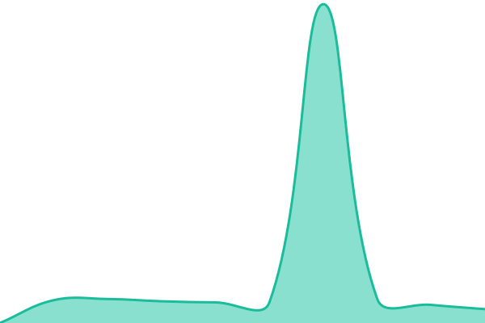
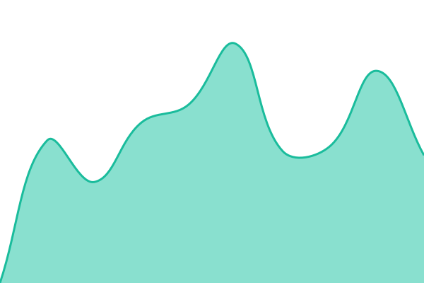
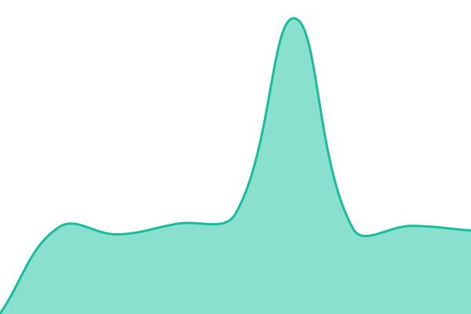

# [📈 Live Status](https://status.aclclouds.com): <!--live status--> **🟧 Partial outage**

This repository contains the open-source uptime monitor and status page for [Aclclouds](https://status.aclclouds.com), powered by [Upptime](https://github.com/upptime/upptime).

With [Upptime](https://upptime.js.org), you can get your own unlimited and free uptime monitor and status page, powered entirely by a GitHub repository. We use [Issues](https://github.com/Aclclouds/aclclouds-status/issues) as incident reports, [Actions](https://github.com/Aclclouds/aclclouds-status/actions) as uptime monitors, and [Pages](https://status.aclclouds.com) for the status page.

<!--start: status pages-->
<!-- This summary is generated by Upptime (https://github.com/upptime/upptime) -->
<!-- Do not edit this manually, your changes will be overwritten -->
<!-- prettier-ignore -->
| URL | Status | History | Response Time | Uptime |
| --- | ------ | ------- | ------------- | ------ |
|  [Panel (dash.aclclouds.com)](https://dash.aclclouds.com) | En ligne | [panel-dash-aclclouds-com.yml](https://github.com/Aclclouds/aclclouds-status/commits/HEAD/history/panel-dash-aclclouds-com.yml) | 

 1105 ms
     
 | 

<a href="https://status.aclclouds.com/history/panel-dash-aclclouds-com">100.00%</a>
    

|  [Site web (aclclouds.com)](https://aclclouds.com) | En ligne | [site-web-aclclouds-com.yml](https://github.com/Aclclouds/aclclouds-status/commits/HEAD/history/site-web-aclclouds-com.yml) | 

 917 ms
     
 | 

<a href="https://status.aclclouds.com/history/site-web-aclclouds-com">100.00%</a>
    

|  [phpMyAdmin](https://phpmyadmin.aclclouds.com) | En ligne | [php-my-admin.yml](https://github.com/Aclclouds/aclclouds-status/commits/HEAD/history/php-my-admin.yml) | 

 1588 ms
     
 | 

<a href="https://status.aclclouds.com/history/php-my-admin">79.30%</a>
    

|  [Panel de test (staging)](https://testpanelaclclouds.aclclouds.com) | En ligne | [panel-de-test-staging.yml](https://github.com/Aclclouds/aclclouds-status/commits/HEAD/history/panel-de-test-staging.yml) | 

 1089 ms
     
 | 

<a href="https://status.aclclouds.com/history/panel-de-test-staging">100.00%</a>
    

|  [Wings1](https://nodes69.aclclouds.com:8080) | En ligne | [wings1.yml](https://github.com/Aclclouds/aclclouds-status/commits/HEAD/history/wings1.yml) | 

 468 ms
     
 | 

<a href="https://status.aclclouds.com/history/wings1">96.77%</a>
    

|  [Wings2](https://nodes77.aclclouds.com:8080) | En ligne | [wings2.yml](https://github.com/Aclclouds/aclclouds-status/commits/HEAD/history/wings2.yml) | 

 447 ms
     
 | 

<a href="https://status.aclclouds.com/history/wings2">98.62%</a>
    

|  [Wings3](https://nodes72.aclclouds.com:8080) | Hors ligne | [wings3.yml](https://github.com/Aclclouds/aclclouds-status/commits/HEAD/history/wings3.yml) | 

 0 ms
     
 | 

<a href="https://status.aclclouds.com/history/wings3">0.00%</a>
    

|  [Wings4](https://nodes78.aclclouds.com:8080) | En ligne | [wings4.yml](https://github.com/Aclclouds/aclclouds-status/commits/HEAD/history/wings4.yml) | 

 495 ms
     
 | 

<a href="https://status.aclclouds.com/history/wings4">96.72%</a>
    

|  [Wings Premium](https://nodes74.aclclouds.com:8080) | En ligne | [wings-premium.yml](https://github.com/Aclclouds/aclclouds-status/commits/HEAD/history/wings-premium.yml) | 

 465 ms
     
 | 

<a href="https://status.aclclouds.com/history/wings-premium">96.72%</a>
    

|  [Game-Nodes 66](https://game-nodes66.aclclouds.com:8080) | Hors ligne | [game-nodes-66.yml](https://github.com/Aclclouds/aclclouds-status/commits/HEAD/history/game-nodes-66.yml) | 

 0 ms
     
 | 

<a href="https://status.aclclouds.com/history/game-nodes-66">0.00%</a>
    

|  [Game-Nodes 67](https://game-nodes67.aclclouds.com:8080) | Hors ligne | [game-nodes-67.yml](https://github.com/Aclclouds/aclclouds-status/commits/HEAD/history/game-nodes-67.yml) | 

 0 ms
     
 | 

<a href="https://status.aclclouds.com/history/game-nodes-67">0.00%</a>
    

|  [Game-Nodes 68](https://game-nodes68.aclclouds.com:8080) | En ligne | [game-nodes-68.yml](https://github.com/Aclclouds/aclclouds-status/commits/HEAD/history/game-nodes-68.yml) | 

 439 ms
     
 | 

<a href="https://status.aclclouds.com/history/game-nodes-68">93.43%</a>
    

|  [Game-Nodes pve6](https://game-nodes-pve6.aclclouds.com:8080) | Hors ligne | [game-nodes-pve6.yml](https://github.com/Aclclouds/aclclouds-status/commits/HEAD/history/game-nodes-pve6.yml) | 

 0 ms
     
 | 

<a href="https://status.aclclouds.com/history/game-nodes-pve6">0.00%</a>
    

|  [Proxmox (cluster1)](https://cluster1.skybots.tech) | En ligne | [proxmox-cluster1.yml](https://github.com/Aclclouds/aclclouds-status/commits/HEAD/history/proxmox-cluster1.yml) | 

 2787 ms
     
 | 

<a href="https://status.aclclouds.com/history/proxmox-cluster1">93.08%</a>
    

<!--end: status pages-->

[**Visit our status website →**](https://status.aclclouds.com)

## 📄 License

- Powered by: [Upptime](https://github.com/upptime/upptime)
- Code: [MIT](./LICENSE) © [Anand Chowdhary](https://anandchowdhary.com)
- Data in the `./history` directory: [Open Database License](https://opendatacommons.org/licenses/odbl/1-0/)
